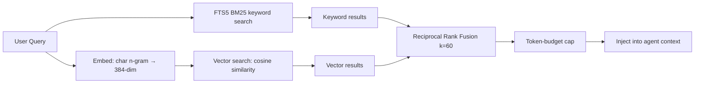

<!-- @dsCard group="Brand" -->
<!-- @dsCard group="Brand" -->
<div align="center">

<!-- 🎨 Premium Swarm Logo / Brand Mark -->


<br />

# Swarm AI

### *Project intelligence lives in the project — not in a chat session.*

<p align="center">
 <strong>A local-first, AI-native desktop development environment</strong><br />
 where multiple coding agents build together, share memory, and never lose context.
</p>

<!-- Badges Row -->
<p>
 <a href="https://github.com/soumyachk101/swarm">
 
 </a>
 <a href="https://tauri.app">
 
 </a>
 <a href="https://www.rust-lang.org">
 
 </a>
 <a href="https://react.dev">
 
 </a>
 <a href="https://www.typescriptlang.org">
 
 </a>
 <a href="https://vitest.dev">
 
 </a>
 
</p>

<p align="center">
 <em>Built by <a href="https://github.com/soumyachk101">Soumya Chakraborty</a> · <a href="mailto:soumya.chk101@gmail.com">soumya.chk101@gmail.com</a></em>
</p>

</div>

---

## Table of Contents

1. [What is Swarm AI?](#what-is-swarm-ai)
2. [Why Swarm AI?](#why-swarm-ai)
3. [Architecture Overview](#architecture-overview)
4. [Core Concepts](#core-concepts)
5. [Features Deep Dive](#features-deep-dive)
6. [Technology Stack](#technology-stack)
7. [How It Works — Step by Step](#how-it-works--step-by-step)
8. [Code Quality & Testing](#code-quality--testing)
9. [Installation & Setup](#installation--setup)
10. [Building from Source](#building-from-source)
11. [Project Structure](#project-structure)
12. [Package Reference](#package-reference)
13. [License](#license)

---

## What is Swarm AI?

**Swarm AI** is a local-first, AI-native desktop development environment built on **Tauri v2** (Rust + React). It lets you run **any CLI coding agent** — Claude Code, Codex CLI, OpenCode, Aider, Cursor, , and more — inside live terminal panes. Every agent reads and writes a **shared, project-scoped memory store** called *Pheromone*, so switching tools or agents never loses context.

Hand a goal to **Lead**, and a team of agents builds it in parallel — each in its own **git worktree**, coordinated by **file-ownership locks** and an **orchestration engine** called *SwarmMind*.

---

## Why Swarm AI?

<div align="center">

| Traditional Workflow | With Swarm AI |
|---|---|
| One agent, one session — context lost when you switch | Shared project memory — every agent sees the same context |
| Sequential coding — one change at a time | Parallel worktrees — multiple agents building simultaneously |
| Manually coordinating agents | Lead planner + SwarmMind orchestration — automated dispatch & merge |
| No memory between sessions | Pheromone persists architecture decisions, patterns, bugs |
| Cloud-dependent AI | Local-first — whisper.cpp voice, SQLite memory, no mandatory API calls |
| Scattered tooling | One surface — Agents, Terminal, Browser, Emulator, Voice |

</div>

---

## Architecture Overview

Swarm follows a **ports-and-adapters** architecture with a strict **purity boundary**:

```
┌─────────────────────────────────────────────────────────────────┐
│ USER INTERACTION │
│ Goal → Lead (planner) → SwarmMind (orchestrator) → Agents │
├─────────────────────────────────────────────────────────────────┤
│ FRONTEND (React + Zustand) │
│ Panes │ Board │ Flow Canvas │ Dock │ Settings │ Voice │
├──────────┼────────┼───────────────┼────────┼────────────┼────────┤
│ TAURI IPC (typed ports) │
├──────────┼────────┼───────────────┼────────┼────────────┼────────┤
│ RUST BACKEND (lib.rs) │
│ PTY │ FS │ Git/Worktree │ Pheromone │ CDP Browser │ Whisper │
├──────────┼────────┼───────────────┼────────┼────────────┼────────┤
│ SHARED MEMORY (Pheromone) │
│ SQLite + FTS5 │ Hybrid Vector+Keyword │ Injection Pipeline │
└─────────────────────────────────────────────────────────────────┘
```

### Key Architectural Principles

| Principle | Implementation |
|-----------|---------------|
| **Purity First** | Core orchestration logic (SwarmMind) is pure — zero `node:` imports. Enforced by automated purity tests. |
| **Ports & Adapters** | Side effects go through typed interfaces (`WorktreeOps`, `HandoffFs`). Node and Tauri supply their own implementations. |
| **Borrow, Never Re-implement** | Each package is standalone. Swarm composes them, never duplicates them. |
| **Self-Enforcing Boundaries** | Tests scan source files for architectural violations (e.g., Node imports in the renderer). |

---

## Core Concepts

### 🧠 Pheromone — Project Memory

Pheromone is a **hybrid retrieval system** that gives every agent shared project context. It combines:

1. **SQLite + FTS5** — Full-text search over `.pheromone/memory/*.md` using BM25 ranking
2. **Deterministic 384-dim char n-gram embeddings** — No external model, no network call. Identical vectors in Rust and JavaScript (L2-normalized trigrams + bigrams + unigrams).
3. **Reciprocal Rank Fusion (k=60)** — Merges keyword and vector signals into one ranked list
4. **Token-budgeted injection** — Chunks are selected up to a configurable token limit



**Memory files** are markdown with YAML frontmatter, organized into:

- `project.md` — Project overview
- `architecture.md` — System design
- `decisions.md` — Architecture Decision Records (ADRs)
- `conventions.md` — Coding standards
- `patterns.md` — Design patterns used
- `bugs.md` — Known bugs and fixes
- `knowledge.md` — General project knowledge
- `agents/sessions/` — Per-session logs (excluded from retrieval to prevent self-pollution)
- `agents/handoffs.md` — Agent handoff transcripts
- `tasks/` — Mission task state

### 🤖 Lead — The Planner

Lead operates in **three modes**, each with distinct personalities and tool permissions:

| Mode | Role | Tools |
|------|------|-------|
| **Steward** | Strategic planner — breaks goals into tasks, dispatches agents, tracks progress | Mutating + read tools |
| **Forager** | Autonomous bug hunter — scans codebase proactively, reports findings | Read-only tools |
| **Stinger** | Security auditor — 5-check security audit (SEC-01 through SEC-05) | Read-only tools |

Lead's workflow:
1. **Listen** — Parse the goal
2. **Read Pheromone** — Load `architecture.md` + `conventions.md` via `pheromone_query`
3. **Break down** — Task list with `owns`, `reads`, `dependsOn`
4. **Assign** — Propose CLI + role per task
5. **Confirm** — Show the plan, get human approval
6. **Dispatch** — Hand off to SwarmMind
7. **Track** — Watch task status via SwarmMind reporting
8. **Summarize** — Changed-files list + one-line outcome per task

### ⚡ SwarmMind — The Orchestrator

SwarmMind is the engine that makes parallel agent work safe:

```
Goal → Breakdown → Plan (lock check) → Dispatch → Worktree → Agent
 ↓
 Complete → Review
 ↓
 Approve → Merge + Release Locks
 ↓
 Reject → Retry
```

**Roles** understood by the orchestrator:

| Role | Can Write | Needs Worktree | Description |
|------|-----------|---------------|-------------|
| **Coordinator** | No | No | Oversees task list, reacts to handoffs, decides sequencing |
| **Builder** | Yes | Yes | Writes code for one task inside its own worktree |
| **Scout** | No | No | Read-only exploration — investigates scope before building |
| **Reviewer** | No | No | Diffs branch against main, checks scope, approves or rejects |

**File-ownership locks** prevent two agents from writing the same file:

- Lock acquired when a task starts
- Conflicts block dispatch — tasks with overlapping `owns` get sequenced
- Locks released only after successful merge
- Survives across multiple dispatch cycles

---

## Features Deep Dive

### 🖥️ Planes (Multi-Pane Workspace)

Swarm uses a **plane-based layout** — one surface at a time, switchable from the title bar:

| Plane | Description |
|-------|-------------|
| **Agents** | Live terminal panes running CLI coding agents over PTY |
| **Terminal** | General-purpose shell pane (bash, zsh, fish, PowerShell, cmd) |
| **Browser** | CDP-powered localhost preview with screenshot capture for agents |
| **Emulator** | Android AVD builder and boot pane with immutable device configs |
| **Board** | Visual task board (Kanban) with drag-and-drop |

### 🌐 Browser Pane (CDP Integration)

The Browser pane drives a **real Chromium** instance over Chrome DevTools Protocol:

- Reuses system-installed Edge/Chrome/Chromium (no bundling)
- Headless mode with fresh temp profile per launch
- CDP port auto-discovery — idempotent launches
- Agent-readable screenshots via CDP
- URL normalization (bare ports → localhost, path → route)

### 🤖 Android Emulator Pane

- Builds **immutable AVD configurations** (device, RAM, storage, cores)
- Generates `config.ini` from typed specs
- Play Store detection on device tags
- Mixed-separator path normalization
- VM heap sizing based on RAM allocation

### 🎙️ Voice — Local Dictation

Fully offline speech-to-text using **whisper.cpp**:

| Model | Quantization | Size |
|-------|-------------|------|
| `tiny.en` | q5_1 | ~75 MB |
| `base.en` | q5_1 | ~142 MB |
| `small.en` (default) | q5_1 | ~466 MB |
| `medium.en` | q5_1 | ~1.5 GB |

- No API key required — models downloaded from HuggingFace on first use
- **Two modes**: Dictation (transcribe + cleanup + inject into focused field) and Voice Command (raw transcript → Lead)
- Optional LLM cleanup for grammar/punctuation (off by default)
- Injectable ports — hotkey service, injection service, STT engine, cleanup service

### 🎨 Themes

Three carefully crafted themes, **all verified against WCAG AA** contrast standards:

| Theme | Palette | Best For |
|-------|---------|----------|
| **Graphite** | Neutral cool grey + amber signals | Default working surface |
| **Obsidian** | Near-black + cold blue | Maximum focus, OLED-friendly |
| **Amber** | Warm orange identity | Cozy workplace feel |

Every foreground token is tested against both surface and canvas at WCAG AA. Control edges (borders) meet the 3:1 contrast spec for non-text UI.

### 🎨 Flow Canvas

An **infinite canvas editor** for visual planning:

- Free-form node placement with snap-to-grid
- Camera system (pan, zoom, fit-to-content, zoom-about-pin)
- Multi-swarm isolation — swarm A's geometry untouched when swarm B lays out
- Z-index ordering per node
- Non-overlapping placement algorithm

### 🔌 Plugin & Extension System

- **SwarmPlugins** — Internal plugin registry with typed interfaces
- **SwarmExtension** — VS Code extension with Open VSX marketplace integration
- Extensions discovered and installed through the marketplace pane

---

## Technology Stack

### Desktop Shell

| Technology | Version | Purpose |
|------------|---------|---------|
| **Tauri** | v2 | Native desktop window, IPC bridge, process/filesystem access |
| **Rust** | 2021 Edition | PTY management, git/worktree operations, SQLite (rusqlite), Pheromone search |
| **portable-pty** | 0.8 | Cross-platform pseudo-terminal for agent panes |
| **rusqlite** | 0.32 (bundled) | SQLite with FTS5 for Pheromone memory |

### Frontend

| Technology | Purpose |
|------------|---------|
| **React** | Component UI, panes, boards |
| **TypeScript** | 5.6 — type safety across all packages |
| **Vite** | Build tooling and dev server |
| **TailwindCSS** | Utility-first styling |
| **Zustand** | Lightweight state management for boards, panes, settings |
| **xterm.js** | Terminal emulation in browser panes |

### AI & Agent Layer

| Technology | Purpose |
|------------|---------|
| **MCP (Model Context Protocol)** | Stdio bridge — exposes `pheromone_query` to every CLI agent |
| **Claude Code** | Primary agent CLI (via `@anthropic-ai/claude-code`) |
| **Codex CLI** | OpenAI's coding agent |
| **OpenCode** | Open-source coding assistant |
| **Aider** | AI pair programming |
| **Cursor CLI** | Cursor editor AI |
| ** Code, Cline, Kiro, Kilo, Antigravity CLI** | Additional supported CLIs |

### Memory & Search

| Technology | Purpose |
|------------|---------|
| **SQLite FTS5** | Full-text search with BM25 ranking |
| **Char n-gram embeddings** | Deterministic 384-dim vectors (no external model) |
| **Reciprocal Rank Fusion** | Merges keyword + vector results (k=60) |
| **Token budgeting** | Caps injected context per agent turn |

### Build & CI

| Technology | Purpose |
|------------|---------|
| **pnpm** | Package manager (workspaces) |
| **Turborepo** | Monorepo build orchestration |
| **Vitest** | Unit testing framework |
| **Tauri CLI** | Desktop app build and packaging |

---

## How It Works — Step by Step

### 1. Open a Project

When you open a project folder in Swarm:

- A `.pheromone/` directory is created with memory subdirectories
- Default memory files are scaffolded (`project.md`, `architecture.md`, etc.)
- Pheromone MCP server path is resolved and auto-registered into each CLI agent's config
- Claude workspace trust is pre-written to `~/.claude.json`
- Files you open are tracked for Pheromone retrieval hints

### 2. Launch Agents

From any plane, add a pane and launch a CLI agent:

```
Shell resolution order:
 1. Absolute path (resolved from npm global + native bins)
 2. PATH lookup (augmented with login shell PATH + npm global dirs)
 3. Platform-specific fallbacks (Windows: APPDATA/npm, macOS: launchctl PATH)
```

Each agent pane gets:
- A real PTY via `portable-pty`
- MCP auto-registration (Pheromone query tool)
- Permission bypass flags where applicable
- Environment variables (API keys from Settings)

### 3. Break Down a Goal

Type a goal into the Lead dock. Lead:

1. Queries Pheromone for project context
2. Breaks the goal into tasks with `owns`, `reads`, `dependsOn`
3. Assigns CLI + role per task
4. Shows draft cards for your approval
5. Dispatches to SwarmMind on confirmation

### 4. Orchestrate in Parallel

SwarmMind's orchestrator:

```
plan(tasks):
 for each task:
 1. Check dependencies → blocked if deps incomplete
 2. Check file locks → blocked if files owned by another task
 3. If clear → canStart

dispatch(task):
 1. Create git worktree (agent/<taskId>)
 2. Register agent in registry
 3. Write handoff file
 4. Launch CLI agent in worktree

approve(agent):
 1. git merge branch back to main
 2. Remove worktree
 3. Release file locks
 4. Mark task as merged
```

### 5. Track & Review

Tasks flow through a **5-column pipeline**:

```
Backlog → Todo → In Progress → Review → Done
```

The Pipeline Board visualizes the entire mission:


### 6. Memory Persists

After each session:
- Agent transcripts logged to `.pheromone/agents/sessions/`
- Findings (bugs, security issues) written to `.pheromone/memory/`
- Architecture decisions logged to `decisions.md`
- On next session, Pheromone injects relevant context automatically

---

## Code Quality & Testing

Swarm maintains **34 test files** across **9 packages** with a rigorous testing philosophy:

### Testing Patterns

| Pattern | Description |
|---------|-------------|
| **Pure Function Testing** | Core logic tested as isolated functions with no I/O — cards, pipeline, embeddings, camera math |
| **Ports/Adapters (DI)** | Side effects injected — in-memory FS for handoffs, fake STT engines for voice |
| **Architecture Purity Guards** | Tests scan all source files for forbidden `node:` imports — Tauri renderer stays clean |
| **Security Testing** | Source-level tests read actual component code and assert no injection vectors |
| **State Migration** | Persisted state from previous versions explicitly tested for correctness |
| **WCAG AA Verification** | Programmatic contrast ratio tests for all theme/token combinations |
| **Immutability Guarantees** | Card operations tested with JSON serialization before/after — zero mutation |
| **Collision Resistance** | ID generators tested for zero collisions across 500+ iterations |

### Test Coverage by Package

```
agents/ 8 test files — CLI integration, security, UI state, spawn lifecycle
board/ 2 test files — Accessibility, brand consistency
flow/ 2 test files — Canvas geometry, camera math
lead/ 2 test files — Task decomposition, mode-based permissions
pheromone/ 2 test files — Search algorithms, plan persistence
swarm/ 4 test files — CDP browser, AVD config, migrations, WCAG contrast
swarmmind/ 5 test files — Orchestration, handoffs, purity guards, messages, dispatch
tasks/ 3 test files — Board ops, card immutability, pipeline construction
voice/ 5 test files — STT engine, voice processor, purity, cleanup
workspace/ 2 test files — Multi-workspace state, MCP configuration
```

### Regression Protection

Every bug fix gets a regression test. Code comments reference specific issues:
- *"The bug this guards: a per-call orchestrator dropped every lock"*
- *"4h 55m vs 2h 2m — usage window reset anchored to wrong timestamp"*
- *"FOREIGN KEY constraint failed on first-time index — upsert order fix"*

---

## Installation & Setup

### Prerequisites

| Requirement | Version | Purpose |
|-------------|---------|---------|
| **Node.js** | ≥ 20.0.0 | JavaScript runtime |
| **pnpm** | ≥ 9.15.0 | Package manager |
| **Rust** | Stable (edition 2021) | Native backend |
| **Tauri v2 deps** | Platform-specific | Desktop shell |
| **CLI Agent** | Any | At least one coding agent on PATH |
| **Android SDK** | Optional | Emulator plane (`emulator` + `platform-tools`) |

> **API Keys**: Provider keys are entered in the in-app Settings panel and stored locally. There are no `.env` files.

### Install & Run

```bash
# Install dependencies
pnpm install

# Build all packages
pnpm turbo build

# Run the desktop app in development mode
cd swarm && pnpm tauri:dev

# Run all tests
pnpm turbo test
```

---

## Building from Source

```bash
# Full build
pnpm install && pnpm turbo build

# Development (hot reload)
cd swarm && pnpm tauri:dev

# Production build (creates installers)
cd swarm && pnpm tauri:build
```

### Installer Outputs

| Platform | Format | Path |
|----------|--------|------|
| **Windows** | NSIS Setup | `swarm/src-tauri/target/release/bundle/nsis/Swarm AI_<version>_x64-setup.exe` |
| **Windows** | MSI | `swarm/src-tauri/target/release/bundle/msi/Swarm AI_<version>_x64_en-US.msi` |
| **macOS** | DMG / App | `swarm/src-tauri/target/release/bundle/dmg/` / `bundle/macos/` |
| **Linux** | AppImage / Deb | `swarm/src-tauri/target/release/bundle/` |

---

## Project Structure

```text
swarm-ai/
│
├── swarm/ # 🖥️ Tauri desktop application
│ ├── src/
│ │ ├── app/ # HomePage shell (title bar, planes, docks)
│ │ ├── features/ # One folder per feature domain
│ │ │ ├── panes/ # └─ Plane host + switcher (multi-pane CSS grid)
│ │ │ ├── browser/ # └─ CDP browser pane (launch, screenshot, navigate)
│ │ │ ├── emulator/ # └─ Android AVD build + boot panes
│ │ │ │ └── android/ # └─ AVD spec validation, config.ini generation
│ │ │ ├── settings/ # └─ Models, providers, settings UI
│ │ │ └── dock/ # └─ Right dock (Lead chat, task board)
│ │ └── shared/ # Cross-feature: Tauri bindings, Zustand stores, logo, themes
│ └── src-tauri/ # Rust backend
│ └── src/
│ └── lib.rs # PTY, FS, Git/Worktree, Pheromone, CDP, Browser, Emulator
│
├── pheromone/ # 🧠 Project memory engine
│ ├── src/
│ │ ├── db/ # SQLite schema, migrations, connection management
│ │ ├── memory/ # MemoryManager — markdown parsing, file tracking
│ │ ├── search/ # Hybrid search engine (FTS5 + vector + RRF)
│ │ ├── injection/ # InjectionPipeline — token-budgeted context injection
│ │ └── plans/ # Plan persistence for Lead missions
│ └── pheromone-mcp/ # MCP stdio server exposing pheromone_query
│
├── swarmmind/ # ⚡ Orchestration engine (pure core)
│ ├── src/
│ │ ├── orchestrator.ts # Plan → Dispatch → Complete → Approve/Reject
│ │ ├── core.ts # Public API — re-exports all modules
│ │ ├── ports.ts # Side-effect interfaces (WorktreeOps, HandoffFs)
│ │ ├── registry/ # AgentRegistry — tracks status, worktree, CLI
│ │ ├── locks/ # LockRegistry — file-ownership lock management
│ │ ├── roles/ # RoleManager — coordinator, builder, scout, reviewer
│ │ ├── worktree/ # Git worktree create/merge/remove operations
│ │ ├── handoffs/ # HandoffManager — markdown handoff format + I/O
│ │ ├── messages/ # MessageBus — point-to-point + broadcast messaging
│ │ └── tauri/ # Desktop adapters (IPC → core)
│ └── tests/ # Orchestrator, handoffs, purity, dispatch tests
│
├── lead/ # 🎯 AI planner
│ ├── src/
│ │ ├── breakdown.ts # Goal → task decomposition
│ │ ├── assignment.ts # CLI + role assignment strategy
│ │ ├── review-routing.ts # Approve/Reassign/Retry routing
│ │ ├── modes.ts # Steward / Forager / Stinger 
│ │ ├── tools.ts # Tool definitions with mode-based permissions
│ │ └── types.ts # LeadTask, BreakdownResult, Assignment types
│ └── tests/ # Breakdown, tools (mode security) tests
│
├── tasks/ # 📋 Task board & pipeline
│ ├── src/
│ │ ├── board.ts # TaskCard type + Board class (stateful)
│ │ ├── cards.ts # Pure card operations (immutable array-in/out)
│ │ ├── pipeline.ts # Pipeline stages (Planner→Coordinator→Build→Merge→Review→Verify)
│ │ ├── dispatch.ts # Dispatch command builder
│ │ └── theme.ts # Task board theming
│ └── tests/ # Board, cards (immutability), pipeline tests
│
├── agents/ # 🤖 Agent launcher & CLI adapters
│ ├── src/
│ │ ├── launcher.ts # AgentLauncher — spawn, track, clean up sessions
│ │ ├── types.ts # Session, AgentStatus, AgentRecord types
│ │ ├── cli-info.ts # CLI_METADATA — 10 CLI agents catalog
│ │ ├── cli-configs/ # Per-CLI config builders (MCP, flags, permission bypass)
│ │ └── ui/ # Agent pane UI logic (spawn guard, sanitize, migration)
│ └── tests/ # Launcher, CLI config, security tests
│
├── voice/ # 🎙️ Local voice layer
│ ├── src/
│ │ ├── voice-processor.ts # Voice orchestrator (dictation + voice command)
│ │ ├── core.ts # Pure core exports
│ │ ├── types.ts # ModelSize, TranscriptionResult, VoiceConfig
│ │ ├── engine/ # WhisperCppEngine — model download + STT
│ │ ├── hotkeys/ # HotkeyService interface + stub
│ │ ├── injection/ # InjectionService interface + stub
│ │ ├── cleanup/ # Optional LLM cleanup service
│ │ └── recorder/ # AudioRecorder interface + stub
│ └── tests/ # 5 test files — engine, processor, purity, cleanup, types
│
├── board/ # 📊 Board primitives & pipeline state
│ ├── src/
│ │ ├── BoardStrip.tsx # Board strip component
│ │ ├── BoardLogo.tsx # Logo component
│ │ ├── LeadCrown.tsx # Lead indicator component
│ │ ├── activatable.ts # Keyboard accessibility (Enter/Space)
│ │ └── themes.ts # Board theme definitions
│ └── tests/ # Activatable (a11y), brand icons
│
├── workspace/ # 🗂️ Workspace coordination
│ ├── src/
│ │ ├── store.ts # Workspace state (folder ↔ swarm binding)
│ │ ├── toolbox.ts # MCP server configuration management
│ │ ├── openFiles.ts # Open file tracking for Pheromone hints
│ │ ├── toolboxIO.ts # File I/O for MCP config
│ │ └── ui/ # Sidebar, toolbox pane, worktree select, dialogs
│ └── tests/ # Store (multi-workspace), toolbox (MCP merge)
│
├── flow/ # 🎨 Visual flow canvas
│ ├── src/
│ │ ├── FlowCanvas.tsx # Infinite canvas component
│ │ ├── CanvasNode.tsx # Node rendering
│ │ ├── CanvasControls.tsx # Zoom, pan, snap controls
│ │ ├── FlowMark.tsx # Canvas watermark
│ │ ├── camera.ts # Camera math (screen↔world, zoom, fit-to)
│ │ └── canvasStore.ts # Zustand store for canvas state
│ └── tests/ # Canvas layout, camera round-trips
│
├── swarmplugins/ # 🔌 Internal plugin registry
│ └── src/
│ ├── registry.ts # Plugin registration & discovery
│ ├── types.ts # Plugin interface definitions
│ └── index.ts # Public exports
│
├── swarmextension/ # 🧩 VS Code extension (private)
│ └── src/
│ ├── ExtensionsMarketplace.tsx # Extension marketplace UI
│ ├── OpenVsxPane.tsx # Open VSX integration pane
│ ├── catalog.ts # Extension catalog
│ └── extensionStore.ts # Extension state management
│
├── design-system/ # 🎨 Design tokens & components
│
├── pnpm-workspace.yaml # Workspace configuration
├── turbo.json # Build pipeline configuration
├── package.json # Root monorepo config
└── LICENSE # Personal, non-commercial license
```

---

## Package Reference

All packages are consumed via `workspace:*` protocol:

| Package | Path | Key Exports | Node-only? |
|---------|------|-------------|-----------|
| `@swarm/pheromone` | `pheromone/` | `Pheromone`, `SearchEngine`, `InjectionPipeline`, `PheromoneDatabase` | No (pure core) |
| `@swarm/pheromone-mcp` | `pheromone/pheromone-mcp/` | `buildCliConfig`, `runPheromoneQuery`, `PHEROMONE_QUERY_TOOL` | Yes (stdio MCP server) |
| `@swarm/mind` | `swarmmind/` | `Orchestrator`, `AgentRegistry`, `LockRegistry`, `RoleManager`, `WorktreeOps`, `HandoffManager`, `MessageBus` | No (`/core` path) |
| `@swarm/lead` | `lead/` | `breakdown`, `DefaultAssignmentStrategy`, `ReviewRouter`, `MODE_SYSTEM_PROMPTS`, `TOOLS` | Yes (LLM-dependent) |
| `@swarm/tasks` | `tasks/` | `Board`, `addCard`, `moveCard`, `removeCard`, `updateCard`, `buildPipeline` | No (pure core) |
| `@swarm/agents` | `agents/` | `AgentLauncher`, `CLI_METADATA`, `buildCliConfig`, `withPermissionBypass` | Yes (process spawning) |
| `@swarm/voice` | `voice/` | `Voice`, `STTEngine`, `AudioRecorder`, `WhisperCppEngine`, `EngineStub` | No (`/core` path) |
| `@swarm/board` | `board/` | Board primitives, pipeline state, theme definitions | No |
| `@swarm/workspace` | `workspace/` | Workspace coordination, store, toolbox I/O, MCP merge | Yes (FS I/O) |
| `@swarm/flow` | `flow/` | `FlowCanvas`, `CanvasNode`, `CanvasControls`, `useCanvasStore`, camera utilities | No |

---

## Supported CLI Agents

Swarm integrates with **10+ CLI coding agents** out of the box:

| Agent | Command | Install | Docs |
|-------|---------|---------|------|
| **Claude Code** | `claude` | `npm install -g @anthropic-ai/claude-code` | [docs.anthropic.com](https://docs.anthropic.com/en/docs/claude-code) |
| **Codex CLI** | `codex` | `npm install -g @openai/codex` | [github.com/openai/codex](https://github.com/openai/codex) |
| **Aider** | `aider` | `pip install aider-chat` | [aider.chat](https://aider.chat/docs/install.html) |
| **Antigravity CLI** | `agy` | `npm install -g @google/antigravity-cli` | [antigravity.google](https://antigravity.google) |
| **OpenCode** | `opencode` | `npm install -g opencode-ai` | [opencode.ai](https://opencode.ai) |
| ** Code** | `kimi` | `pip install ` | [kimi..cn]() |
| **Cline** | `cline` | `npm install -g cline` | [github.com/cline/cline](https://github.com/cline/cline) |
| **Cursor CLI** | `cursor` | Cursor IDE (CLI ships with the app) | [cursor.com](https://cursor.com/downloads) |
| **Kiro CLI** | `kiro` | `npm install -g kiro-cli` | [kiro.dev](https://kiro.dev) |
| **Kilo** | `kilo` | `npm install -g kilo-ai` | [kilo.ai](https://kilo.ai) |

Each agent gets:
- MCP auto-registration with Pheromone query tool
- Permission bypass flags (where supported)
- Proper PATH resolution (login shell + npm global bins)
- Context injection from Pheromone before each turn

---

## Key Implementation Details

### Hybrid Retrieval (Pheromone Search)

The search pipeline in `lib.rs` (Rust) and mirrored in JS:

1. **Sanitize** query — strip FTS5 metacharacters (`"`, `(`, `)`, `*`, leading `-`)
2. **Keyword search** — FTS5 BM25 over all memory chunks
3. **Vector search** — Embed query + all chunks with deterministic 384-dim char n-gram, cosine similarity
4. **RRF merge** — Reciprocal Rank Fusion with k=60
5. **Token budget** — Cap injected chunks at configurable token limit

### Rust Backend Commands (lib.rs)

| Command | Purpose |
|---------|---------|
| `spawn_terminal` | Create PTY session, spawn child process, stream output via events |
| `write_to_terminal` | Write stdin to PTY master |
| `resize_terminal` | Resize PTY (SIGWINCH) |
| `kill_terminal` | Kill child + reap |
| `create_worktree` | Git worktree creation with conflict resolution (20 retry attempts) |
| `merge_worktree` | Git merge + worktree removal |
| `pheromone_ensure_structure` | Create `.pheromone/` directory tree + default memory files |
| `pheromone_read/write_memory_file` | CRUD on `.pheromone/memory/*.md` |
| `pheromone_index_file` | Chunk + embed + index a memory file (incremental by mtime) |
| `pheromone_search` | Hybrid FTS5 + vector + RRF search |
| `pheromone_inject` | Token-budgeted context injection |
| `pheromone_log_session` | Log agent session to `.pheromone/agents/sessions/` |
| `pheromone_list_sessions` | Enumerate sessions with frontmatter parsing |
| `launch_cdp_browser` | Headless Chromium with CDP for Browser pane |
| `git_status` | Branch + changed file count |
| `git_push` / `git_pull` | Remote operations |
| `detect_shells` | Platform-aware shell detection |
| `copy_dir` / `remove_dir` | Skill installation/uninstallation |
| `get_pheromone_mcp_path` | Resolve MCP server path across cwd changes |

### PATH Resolution Strategy

The Rust backend solves the classic *"works in Terminal, not from Dock"* problem:

```
augmented_path_env = process PATH
 + login shell PATH (launchctl on macOS, $SHELL -lc on Linux)
 + npm global bins (APPDATA/npm, .npm-global, .cargo, .bun)
 + Homebrew dirs (/opt/homebrew/bin, /usr/local/bin)
```

Timeout: 3 seconds for login shell probe — never blocks pane spawn.

---

## License

**Personal, non-commercial use only.**

Permission is granted, free of charge, to any individual to use, copy, modify, and share this software and its source code for **personal, non-commercial purposes only**.

- You may run, study, modify, and make personal copies for your own private, educational, or non-commercial projects.
- You may share the software and your modifications, provided this license and the copyright notice are included unchanged, and it is shared for non-commercial purposes only.
- **Commercial use is NOT permitted** — selling, licensing, sublicensing, or using this within a for-profit organization's operations is prohibited.
- This license does not grant rights to use the "Swarm" name, logo, or branding except as required to give attribution.

For a commercial license, contact [soumya.chk101@gmail.com](mailto:soumya.chk101@gmail.com).

---

## Links

<div align="center">

| Resource | Link |
|----------|------|
| **GitHub Repository** | [github.com/soumyachk101/swarm](https://github.com/soumyachk101/swarm) |
| **Author** | [@soumyachk101](https://github.com/soumyachk101) |
| **Email** | soumya.chk101@gmail.com |

</div>
